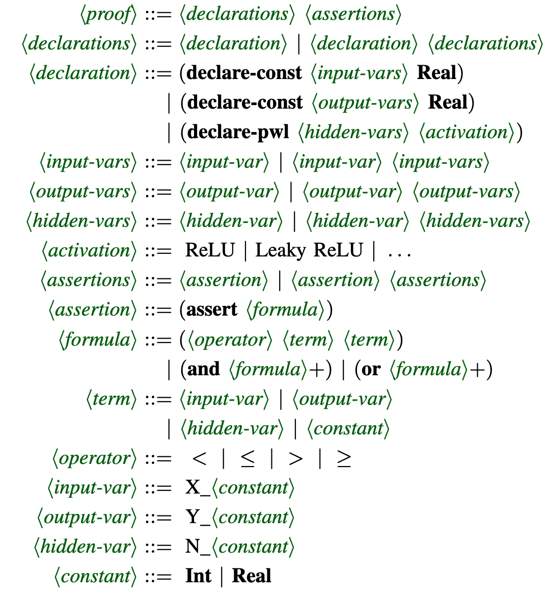
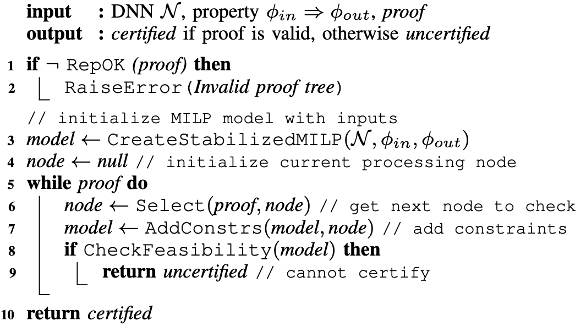
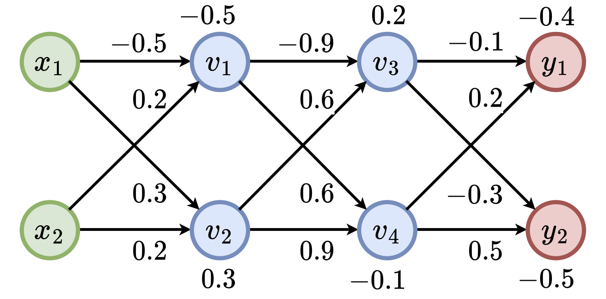
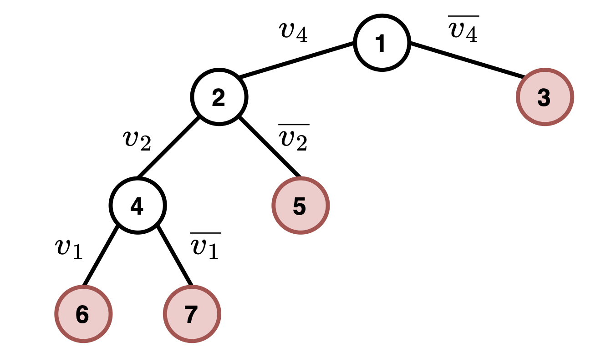

# Generating and Checking DNN Verification Proofs

Many dozens of Neural Network Verification (NNV) tools have been developed in recent years and as a field these techniques have matured to the point where realistic networks can be analyzed to detect flaws and to prove conformance with specifications. 
NNV tools are highly-engineered and complex may harbor flaws that cause them to produce unsound results.

We identify commonalities in the algorithmic approaches taken by NNV tools to define a verifier independent proof format – Activation Pattern Tree Proofs (`APTP`) – and design an algorithm for checking those proofs that is proven correct and optimized to enable scalable checking. 
We demonstrate that existing verifiers can efficiently generate APTP proofs, and that
an `APTPchecker` tool significantly outperforms prior work, and that it is robust to variation in `APTP` proof structure arising from different NNV tools.

#### The `APTP` proof language

<div style="display: flex; justify-content: space-between;">
    
</div>

#### The `APTPchecker` algorithm:

<div style="display: flex; justify-content: space-between;">
    
</div>


## Installation

- Install required libraries:

```bash
pip3 install -r requirements.txt
```

- `APTPchecker` relies on `Gurobi`. Free academic license is available at [Request License](https://portal.gurobi.com/iam/licenses/request). 

## Getting Started

- Minimal command:

```bash
python3 main.py --onnx ONNX_PATH --aptp APTP_PATH 
```

- Additional options:

```bash
python3 main.py [-h] --onnx ONNX --aptp APTP [--batch BATCH] [--timeout TIMEOUT] 
```

- `--onnx`: Path to `ONNX` model.
- `--aptp`: Path to `APTP` proof file.
- `--batch`: Maximum number of nodes to check in parallel.
- `--timeout`: Timeout (in second).

## Examples

- A DNN (left) and a proof tree (right) produced verifying the property $(x_1, x_2) \in [-2.0, 2.0] \times [-1.0, 1,0] \Rightarrow (y_1 > y_2)$

<div style="display: flex; justify-content: space-between;">
    
    
</div>

- Example of APTP format for the proof tree:

```SQL
; Input variables
(declare-const X_0 Real)
(declare-const X_1 Real)

; Output variables
(declare-const Y_0 Real)
(declare-const Y_1 Real)

; Hidden variables
(declare-pwl N_1 ReLU)
(declare-pwl N_2 ReLU)
(declare-pwl N_3 ReLU)
(declare-pwl N_4 ReLU)

; Input constraints
(assert (>= X_0 -2.0))
(assert (<= X_0  2.0))
(assert (>= X_1 -1.0))
(assert (<= X_1  1.0))

; Hidden constraints
(assert (or
    (and (<  N_4 0))
    (and (<  N_2 0) (>= N_4 0))
    (and (>= N_2 0) (>= N_1 0) (>= N_4 0))
    (and (>= N_2 0) (<  N_1 0) (>= N_4 0))
))

; Output constraints
(assert (<= Y_0 Y_1))
```

- Check the APTP proof:

```bash
python3 main.py --onnx example/sample.onnx --aptp example/sample.aptp
python3 main.py --onnx example/sample.onnx --aptp example/sample_input.aptp
```


```bash
python3 main.py --net example/proof/sample.onnx --spec example/proof/sample.vnnlib --setting_file example/proof/proof_setting.json --device cpu --reasoning_output example/aptp/ --force_split input
```